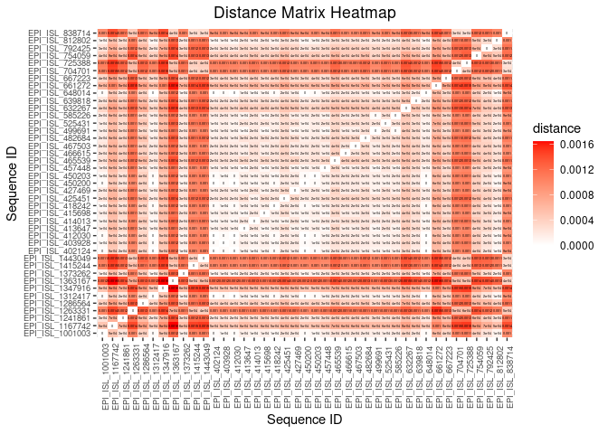
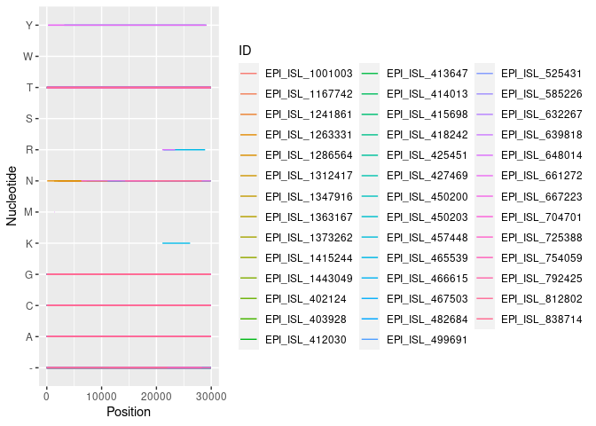
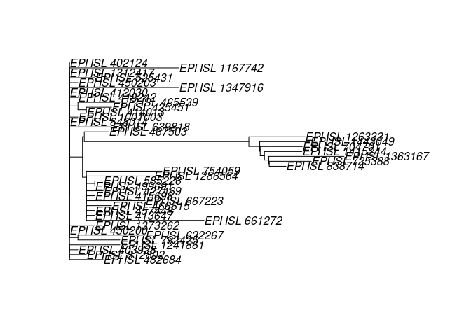

Project1
================
Alec Agha (ama5624)

## Introduction

In this study, I attempt to trace back how the newly dominant COVID-19
strand B.1.1.7 originated by looking at a select sample of genomes
across its lineages. A total of 41 genomes (out of 997,931 total
recorded viruses) were selected over the course of 16 months from the
GISAID EpiCoV database. Each genome can be cross referenced using the
“ID” variable. Apart from finding samples from each of B.1.1.7’s
lineages (B, B.1, B.1.1, and B.1.1.7 itself) over the course of time
since the human coronavirus was first identified, each sample from these
lineages was chosen at random.

The idea behind tracing the progression of each lineage was to look at
each individual nucleotide from the sample of genomes as unique
observations. Comparatively looking at each unique sequence positions
would then show where and when each sample’s sequence differs. Each of
the three datasets used below were formed by myself based off
information from the GISAID database, and thus keeping each observation
tidy was kept in mind ahead of time.

The “seq\_aligned” dataframe was created first by downloading individual
fasta files of each sequence, appending them together into one fasta
file, and running this file with the program Clustalo Omega. Clustalo
Omega uses an algorthim to match and align each sequence of different
lengths with the others in the closest way possible. Once each sequence
was newly aligned, and thus had the same length of nucleotides, I ran a
short python program to transform the aligned fasta file into a table so
that each position of each sequence could be recorded as an observation.

## Data Collection/Transformation

Because I already created the text and csv files keeping a tidy format
in mind, no additional transformations were required for the three
dataframes.

“seq\_aligned” was united with “seq\_info” using a left join with the
“ID” and “id” variables as the key. “seq\_regions” was then added
similarly, only with “Position” as the key. No observations with NA
variables were removed, since each observation still coincides with a
nucleotide, unique either in position or in viral name.

Additionally, to have a useful numeric variable, an upper triangular
distance matrix was created out of the originally aligned fasta file,
which calculates the genetic distance between each of the strands as a
whole.

``` r
# collecting
seq_aligned <- 
read.table("/home/oreodog/Desktop/Files/projects/covid/part1/CovidSeqData/CovidSeqTable.txt", sep="\t", header=TRUE) # .txt containing aligned sequences 
seq_info <- read.csv("/home/oreodog/Desktop/Files/projects/covid/part1/CovidSeqInfo.csv") # .csv file containing additional information for each sequence
seq_regions <- read.csv("/home/oreodog/Desktop/Files/projects/covid/part1/CovidSeqRegions.csv") # .csv file containing coding region information

# merging together
seq_data <- seq_aligned %>%
  left_join(seq_info, by=c("ID"="id")) %>%
  left_join(seq_regions, by="Position")

# turning categorical nucleotide data into a numerical distance matrix
sequences <- read.alignment("/home/oreodog/Desktop/Files/projects/covid/part1/CovidSeqData/CovidSeqAligned.fasta", format="fasta") # stores genomes as a string for each viral sample
seq_bin <- as.DNAbin(sequences) # converts to a compressed DNA binary format
seq_dist <- as.matrix(dist.dna(seq_bin)) # creates a distance matrix between each sample
```

## Summary Statistics

``` r
# arrange unique sequences by days since first infection (EPI_ISL_402124 is the reference genome and is thought to be the first Covid case in a human)
seq_data %>%
  group_by(ID) %>%
  summarize(day = unique(day)) %>%
  arrange(day)
```

    ## # A tibble: 41 x 2
    ##    ID                day
    ##    <fct>           <int>
    ##  1 EPI_ISL_402124      0
    ##  2 EPI_ISL_403928      2
    ##  3 EPI_ISL_450200     29
    ##  4 EPI_ISL_450203     33
    ##  5 EPI_ISL_412030     34
    ##  6 EPI_ISL_1263331    47
    ##  7 EPI_ISL_466615     48
    ##  8 EPI_ISL_415698     60
    ##  9 EPI_ISL_413647     62
    ## 10 EPI_ISL_414013     62
    ## # … with 31 more rows

``` r
# arrange each lineage+clade combination with the average time since first infection, including the counts (29903 nucleotides = 1 sequence)
seq_data %>%
  group_by(lineage, clade) %>%
  summarize(mean_day = mean(day), sequence_count=n()/29903) %>%
  arrange(mean_day)
```

    ## `summarise()` has grouped output by 'lineage'. You can override using the `.groups` argument.

    ## # A tibble: 8 x 4
    ## # Groups:   lineage [4]
    ##   lineage clade mean_day sequence_count
    ##   <fct>   <fct>    <dbl>          <dbl>
    ## 1 B.1.1.7 G         47                1
    ## 2 B       V         93                1
    ## 3 B       L         93.2              4
    ## 4 B.1     G        114                4
    ## 5 B.1.1   GR       167.              11
    ## 6 B       O        197.               8
    ## 7 B.1     GH       242.               6
    ## 8 B.1.1.7 GRY      294.               6

``` r
# arrange the region of the sequences by the positions in which the occur, and show these positions as a length
seq_data %>%
  na.omit(Region) %>% # remove nucleotides with no "Region"
  group_by(Region) %>%
  summarize(position_start=range(Position)[1], position_end=range(Position)[2]) %>%
  mutate(length=position_end-position_start) %>%
  arrange(position_start)
```

    ## # A tibble: 16 x 4
    ##    Region       position_start position_end length
    ##    <fct>                 <int>        <int>  <int>
    ##  1 ORF1a ORF1ab            266        13468  13202
    ##  2 ORF1ab                13469        21555   8086
    ##  3 S                     21563        25384   3821
    ##  4 ORF3a                 25393        25764    371
    ##  5 ORF3a ORF3b           25765        26220    455
    ##  6 E                     26245        26472    227
    ##  7 M                     26523        27191    668
    ##  8 ORF6                  27202        27387    185
    ##  9 ORF7a                 27394        27755    361
    ## 10 ORF7a ORF7b           27756        27759      3
    ## 11 ORF7b                 27760        27887    127
    ## 12 ORF8                  27894        28259    365
    ## 13 N                     28274        29553   1279
    ## 14 N ORF9a               28284        28577    293
    ## 15 N ORF9b               28734        28955    221
    ## 16 ORF10                 29558        29674    116

``` r
# count the amount of times A, T, G, C, -, or N occur for each position; if the total is 41 for any case, then that position is identical in all the sequences
matches <- seq_data %>%
  group_by(Position) %>%
  summarize(A_count=sum(Nucleotide=="A"),
            T_count=sum(Nucleotide=="T"),
            G_count=sum(Nucleotide=="G"),
            C_count=sum(Nucleotide=="C"),
            "-_count"=sum(Nucleotide=="-"),
            N_count=sum(Nucleotide=="N")) %>%
  mutate(match=A_count==41 |
           T_count==41 |
           G_count==41 |
           C_count==41 |
           "-_count"==41 | 
           N_count==41)
matches
```

    ## # A tibble: 29,903 x 8
    ##    Position A_count T_count G_count C_count `-_count` N_count match
    ##       <int>   <int>   <int>   <int>   <int>     <int>   <int> <lgl>
    ##  1        1       8       0       0       0        33       0 FALSE
    ##  2        2       0       8       0       0        33       0 FALSE
    ##  3        3       0      10       0       0        31       0 FALSE
    ##  4        4      11       0       0       0        30       0 FALSE
    ##  5        5      14       0       0       0        27       0 FALSE
    ##  6        6      14       0       0       0        27       0 FALSE
    ##  7        7       0       0      16       0        25       0 FALSE
    ##  8        8       0       0      16       0        25       0 FALSE
    ##  9        9       0      18       0       0        23       0 FALSE
    ## 10       10       0      18       0       0        23       0 FALSE
    ## # … with 29,893 more rows

``` r
# arrange each region by the amount of times it has a mismatch; shows region variability within the data
seq_regions %>%
  full_join(matches[,c(1,8)], by="Position") %>%
  group_by(Region) %>%
  summarize(mismatch_count = sum(match==FALSE)) %>%
  arrange(desc(mismatch_count))
```

    ## # A tibble: 17 x 2
    ##    Region       mismatch_count
    ##    <fct>                 <int>
    ##  1 ORF1ab                  719
    ##  2 ORF1a ORF1ab            606
    ##  3 S                       461
    ##  4 <NA>                    240
    ##  5 M                        17
    ##  6 N                        11
    ##  7 N ORF9b                  11
    ##  8 ORF3a ORF3b              10
    ##  9 ORF3a                     9
    ## 10 ORF8                      9
    ## 11 E                         2
    ## 12 N ORF9a                   1
    ## 13 ORF6                      1
    ## 14 ORF10                     0
    ## 15 ORF7a                     0
    ## 16 ORF7a ORF7b               0
    ## 17 ORF7b                     0

``` r
# sort sequences by their distance from the reference genome EPI_ISL_402124
reference_distance <- seq_dist %>%
  as.data.frame() %>%
  rownames_to_column(var="ID") %>%
  select(c(1:2,)) %>%
  arrange(EPI_ISL_402124)
reference_distance
```

    ##                 ID EPI_ISL_402124
    ## 1   EPI_ISL_402124   0.000000e+00
    ## 2   EPI_ISL_412030   0.000000e+00
    ## 3   EPI_ISL_648014   0.000000e+00
    ## 4  EPI_ISL_1312417   0.000000e+00
    ## 5   EPI_ISL_450200   0.000000e+00
    ## 6   EPI_ISL_403928   3.572800e-05
    ## 7   EPI_ISL_450203   3.572832e-05
    ## 8   EPI_ISL_418242   3.572832e-05
    ## 9  EPI_ISL_1001003   3.572832e-05
    ## 10  EPI_ISL_414013   7.145920e-05
    ## 11  EPI_ISL_812802   7.145920e-05
    ## 12 EPI_ISL_1373262   1.071898e-04
    ## 13  EPI_ISL_525431   1.071898e-04
    ## 14  EPI_ISL_499691   1.071898e-04
    ## 15  EPI_ISL_413647   1.071926e-04
    ## 16  EPI_ISL_457448   1.071926e-04
    ## 17  EPI_ISL_415698   1.071926e-04
    ## 18  EPI_ISL_585226   1.429222e-04
    ## 19  EPI_ISL_427469   1.429245e-04
    ## 20  EPI_ISL_482684   1.429286e-04
    ## 21  EPI_ISL_467503   1.786617e-04
    ## 22  EPI_ISL_425451   1.786671e-04
    ## 23  EPI_ISL_639818   1.786671e-04
    ## 24  EPI_ISL_466615   1.786671e-04
    ## 25  EPI_ISL_792425   2.143967e-04
    ## 26 EPI_ISL_1241861   2.144015e-04
    ## 27  EPI_ISL_465539   2.144082e-04
    ## 28  EPI_ISL_667223   3.216210e-04
    ## 29  EPI_ISL_632267   3.216468e-04
    ## 30 EPI_ISL_1286564   3.573982e-04
    ## 31  EPI_ISL_754059   3.931389e-04
    ## 32 EPI_ISL_1347916   4.646083e-04
    ## 33 EPI_ISL_1167742   4.646518e-04
    ## 34  EPI_ISL_661272   5.718575e-04
    ## 35  EPI_ISL_838714   9.295062e-04
    ## 36 EPI_ISL_1263331   9.653125e-04
    ## 37  EPI_ISL_704701   1.001068e-03
    ## 38 EPI_ISL_1415244   1.001081e-03
    ## 39 EPI_ISL_1443049   1.036867e-03
    ## 40  EPI_ISL_725388   1.036867e-03
    ## 41 EPI_ISL_1363167   1.180016e-03

``` r
# find average age of patients from data
seq_data %>%
  summarize(mean(patient_age, na.rm=TRUE))
```

    ##   mean(patient_age, na.rm = TRUE)
    ## 1                           55.44

``` r
# show locations of data collected
seq_data %>%
  group_by(location) %>%
  summarize(n()/29903)
```

    ## # A tibble: 24 x 2
    ##    location    `n()/29903`
    ##    <fct>             <dbl>
    ##  1 Afghanistan           1
    ##  2 Algeria               1
    ##  3 Angola                1
    ##  4 Argentina             1
    ##  5 Australia             1
    ##  6 Bahrain               1
    ##  7 Bangladesh            1
    ##  8 Belgium               1
    ##  9 Chile                 1
    ## 10 Ecuador               1
    ## # … with 14 more rows

``` r
# sort each lineage by their average distance to the original reference genome (lineage B)
seq_data %>%
  full_join(reference_distance, by="ID") %>%
  group_by(lineage) %>%
  summarize(reference_distance = mean(EPI_ISL_402124)) %>%
  arrange(desc(reference_distance))
```

    ## # A tibble: 4 x 2
    ##   lineage reference_distance
    ##   <fct>                <dbl>
    ## 1 B.1.1.7           0.00102 
    ## 2 B.1.1             0.000195
    ## 3 B.1               0.000186
    ## 4 B                 0.000124

``` r
# table of each sequence nucleotides at positions where there is a difference
mismatches <- matches %>%
  filter(match==FALSE) %>%
  select(Position)
seq_data %>%
  filter(Position %in% mismatches$Position) %>%
  select(Position, Nucleotide, ID) %>%
  pivot_wider(names_from=Position, values_from=Nucleotide)
```

    ## # A tibble: 41 x 2,098
    ##    ID    `1`   `2`   `3`   `4`   `5`   `6`   `7`   `8`   `9`   `10`  `11`  `12` 
    ##    <fct> <fct> <fct> <fct> <fct> <fct> <fct> <fct> <fct> <fct> <fct> <fct> <fct>
    ##  1 EPI_… A     T     T     A     A     A     G     G     T     T     T     A    
    ##  2 EPI_… A     T     T     A     A     A     G     G     T     T     T     A    
    ##  3 EPI_… -     -     -     -     -     -     -     -     -     -     -     -    
    ##  4 EPI_… -     -     -     -     -     -     G     G     T     T     T     A    
    ##  5 EPI_… -     -     -     -     -     -     -     -     -     -     -     -    
    ##  6 EPI_… -     -     -     -     -     -     -     -     -     -     -     -    
    ##  7 EPI_… -     -     -     -     -     -     -     -     -     -     -     -    
    ##  8 EPI_… -     -     -     -     -     -     -     -     -     -     -     -    
    ##  9 EPI_… A     T     T     A     A     A     G     G     T     T     T     A    
    ## 10 EPI_… A     T     T     A     A     A     G     G     T     T     T     A    
    ## # … with 31 more rows, and 2,085 more variables: 13 <fct>, 14 <fct>, 15 <fct>,
    ## #   16 <fct>, 17 <fct>, 18 <fct>, 19 <fct>, 20 <fct>, 21 <fct>, 22 <fct>,
    ## #   23 <fct>, 24 <fct>, 25 <fct>, 26 <fct>, 27 <fct>, 28 <fct>, 29 <fct>,
    ## #   30 <fct>, 31 <fct>, 32 <fct>, 33 <fct>, 34 <fct>, 35 <fct>, 36 <fct>,
    ## #   37 <fct>, 38 <fct>, 39 <fct>, 40 <fct>, 41 <fct>, 42 <fct>, 43 <fct>,
    ## #   44 <fct>, 45 <fct>, 46 <fct>, 47 <fct>, 48 <fct>, 49 <fct>, 50 <fct>,
    ## #   51 <fct>, 52 <fct>, 53 <fct>, 54 <fct>, 76 <fct>, 78 <fct>, 79 <fct>,
    ## #   80 <fct>, 81 <fct>, 82 <fct>, 83 <fct>, 84 <fct>, 85 <fct>, 86 <fct>,
    ## #   87 <fct>, 88 <fct>, 89 <fct>, 90 <fct>, 91 <fct>, 92 <fct>, 93 <fct>,
    ## #   94 <fct>, 95 <fct>, 96 <fct>, 97 <fct>, 98 <fct>, 99 <fct>, 100 <fct>,
    ## #   101 <fct>, 102 <fct>, 103 <fct>, 104 <fct>, 105 <fct>, 106 <fct>,
    ## #   107 <fct>, 108 <fct>, 109 <fct>, 110 <fct>, 111 <fct>, 174 <fct>,
    ## #   203 <fct>, 210 <fct>, 241 <fct>, 264 <fct>, 313 <fct>, 413 <fct>,
    ## #   832 <fct>, 913 <fct>, 1059 <fct>, 1141 <fct>, 1150 <fct>, 1158 <fct>,
    ## #   1170 <fct>, 1314 <fct>, 1339 <fct>, 1340 <fct>, 1341 <fct>, 1342 <fct>,
    ## #   1343 <fct>, 1344 <fct>, 1345 <fct>, 1346 <fct>, …

1.  Tibble is sorted to show which ID’s were collected in sequential
    order based on days since the start of the covid pandemic
2.  Tibble which shows the average length of time from the start of the
    pandemic for each clade and lineage combination. The four different
    lineages can be find throughout the span of time, but shows an
    overall order in the presence of clades over time.
3.  The sequential order of the coding regions and where they are found
    in the hCov-19 genome, as well as each coding region’s length, is
    represented here.
4.  This tibble shows which positions have all identical matches
    throughout the different sequences and which do not via counting
    what nucleotide is present at each unique position. Each time there
    is not a match, usually it’s due to one or more of the sequences
    having an “N” or “-” as said position, which can be interpreted as
    indels (insertion or deletions).
5.  Using the boolean “match” variable, it can be seen which coding
    regions possess the most and least variation in nucleotide changes.
6.  Tibble which represents in order which sequence is furthest from the
    reference genome EPI\_ISL\_402124 (first covid case sequenced)
7.  The mean age of the patients from the sequences collected was 55.44
    years old.
8.  The sequence data retrieved was done so without location in mind,
    but this tibble shows location counts for the samples taken.
9.  Using the first column of data from the distance matrix (each sample
    ID distance to the reference sequence EPI\_ISL\_402124), the tibble
    is arranged to show how each lineage’s sequences on average grow
    further distant from the first genome sequenced.
10. Tibble which compares each sequences’ nucleotides at positions where
    at least one of the sequences differs.

## Visualizations

``` r
# heatmap using the previously calculated distance matrix
seq_dist %>%
  as.data.frame() %>%
  rownames_to_column %>%
  pivot_longer(-1, names_to="other_var", values_to="distance") %>%
  ggplot(aes(rowname, other_var, fill=distance)) +
  geom_tile() +
  scale_fill_gradient2(low="blue", high="red") +
  geom_text(aes(label = round(distance,4)), color="black", size=1) +
  labs(title = "Distance Matrix Heatmap", x = "Sequence ID", y = "Sequence ID") +
  theme(axis.text.x = element_text(size=7, angle=90),
        axis.text.y = element_text(size=7),
        plot.title = element_text(hjust=0.5))
```

<!-- -->

``` r
seq_data %>%
  ggplot(aes(x=Position, y=Nucleotide)) +
  geom_line(aes(color=ID))
```

<!-- -->

## Dimensionality Reduction

``` r
pca <- prcomp(seq_dist, scale=TRUE)
plot(x=pca$x[,1], y=pca$x[,2], xlab="PC1", ylab="PC2", main="PCA")
text(pca$x[,2]~pca$x[,1], labels=rownames(pca$x))
```

<!-- -->

``` r
phylo <- nj(dist.dna(seq_bin))
phylo <- root(phylo, "EPI_ISL_402124", r=TRUE)
plot.phylo(phylo, type="p")
```

<!-- -->
