Modeling Beehive Activity Based on the Environment
================
Alec Agha

## Introduction

The following data was taken from HOBOS (HOneyBee Online Studies) found
at <https://www.aura-saale.de/umweltschutz/hobos/>. HOBOS is a high-tech
research and education program which monitors several different honeybee
hives. Two different hives (Schwartau and Wurzburg) were monitored with
sensors measuring internal humidity (%) and temperature (ºC), the weight
of the beehive (kg), and the flow of bees. Bee flow is measured as the
amount of bees which entered the hive (positive number) as well as the
amount of bees which left the hive (negative number).

Each of these variables are measured with time stamps over the course of
about 2.5 years. For this reason the data can be considered tidy, with
each time stamp as a unique point of observation. The probes however are
not synchronized, thus each time stamp may or may not contain every
variable. All observations can be considered however for this project,
in which NA values will be ignored. When combining all the sensors’
data, there is a total of 5,928,266 unique points of observation. This
is due to the frequency each sensor collected data. In order to make
these observations more manageable, each of the variables was converted
to their mean statistic on that day.

I find this dataset interesting for two reasons: beehives themselves can
be seen as living, dynamically changing systems, and the amount of data
monitored by this study is extensive in detail. Considering there is
some form of a dynamic relationship and interaction between a beehive
and its environment, I expect to find a relationship between the hives’
environment (“temperature” and “humidity”) and its activity (“flow” and
“weight”).

## Data Collection/Transformation

``` r
# gather data
flow_schwartau <- read.csv("/home/oreodog/Desktop/Files/projects/bees/flow_schwartau.csv")
flow_wurzburg <- read.csv("/home/oreodog/Desktop/Files/projects/bees/flow_wurzburg.csv")
humidity_schwartau <- read.csv("/home/oreodog/Desktop/Files/projects/bees/humidity_schwartau.csv")
humidity_wurzburg <- read.csv("/home/oreodog/Desktop/Files/projects/bees/humidity_wurzburg.csv")
temperature_schwartau <- read.csv("/home/oreodog/Desktop/Files/projects/bees/temperature_schwartau.csv")
temperature_wurzburg <- read.csv("/home/oreodog/Desktop/Files/projects/bees/temperature_wurzburg.csv")
weight_schwartau <- read.csv("/home/oreodog/Desktop/Files/projects/bees/weight_schwartau.csv")
weight_schwartau$weight <- weight_schwartau$weight/1000 # convert grams to kilograms
weight_wurzburg <- read.csv("/home/oreodog/Desktop/Files/projects/bees/weight_wurzburg.csv")

# add a categorical variable indicating the hive
flow_schwartau$hive <- "schwartau"
humidity_schwartau$hive <- "schwartau"
temperature_schwartau$hive <- "schwartau"
weight_schwartau$hive <- "schwartau"
flow_wurzburg$hive <- "wurzburg"
humidity_wurzburg$hive <- "wurzburg"
temperature_wurzburg$hive <- "wurzburg"
weight_wurzburg$hive <- "wurzburg"

# combine datasets
flow <- bind_rows(flow_schwartau, flow_wurzburg)
humidity <- bind_rows(humidity_schwartau, humidity_wurzburg)
temperature <- bind_rows(temperature_schwartau, temperature_wurzburg)
weight <- bind_rows(weight_schwartau, weight_wurzburg)
bees <- flow %>% 
  merge(humidity, all.x=TRUE, all.y=TRUE) %>% 
  merge(temperature, all.x=TRUE, all.y=TRUE) %>% 
  merge(weight, all.x=TRUE, all.y=TRUE)

# make data more manageable
begin <- as_datetime("2017-01-01 0:00:00") # first day
bees <- bees %>% 
  mutate(timestamp = as_datetime(timestamp), day = floor(interval(begin,timestamp)/days(1))+1) %>%
  group_by(day,hive) %>%
  summarize(flow = mean(flow,na.rm=TRUE), humidity = mean(humidity,na.rm=TRUE), temperature = mean(temperature,na.rm=TRUE), weight = mean(weight,na.rm=TRUE))
```

    ## `summarise()` has grouped output by 'day'. You can override using the `.groups` argument.

## EDA

``` r
# mean statistics for the two hives
bees %>%
  group_by(hive) %>%
  summarize(flow = mean(flow,na.rm=TRUE), humidity = mean(humidity,na.rm=TRUE), temperature = mean(temperature,na.rm=TRUE), weight = mean(weight,na.rm=TRUE))
```

    ## # A tibble: 2 x 5
    ##   hive        flow humidity temperature weight
    ##   <chr>      <dbl>    <dbl>       <dbl>  <dbl>
    ## 1 schwartau  1.62      84.0        22.6   56.9
    ## 2 wurzburg  -0.564     76.1        16.5   53.6

``` r
# correlation matrix
correlations <- pairs.panels(bees[,3:6], 
             method = "pearson", # correlation coefficient method
             hist.col = "yellow", # color of bees
             smooth = FALSE, density = FALSE, ellipses = FALSE)
```

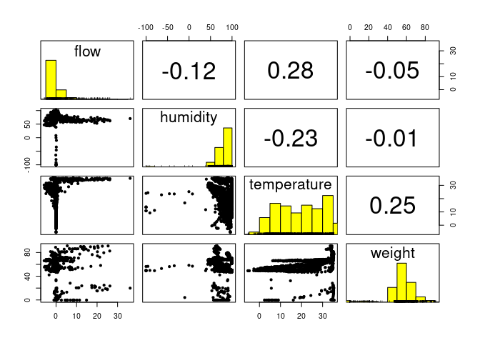<!-- -->

``` r
# display data over time
ggplot(bees, aes(x=day, y=flow, color=hive)) +
  geom_point() +
  labs(title="Bee Flow", x="Date", y="Number of Bees Entering/Exiting")
```

    ## Warning: Removed 153 rows containing missing values (geom_point).

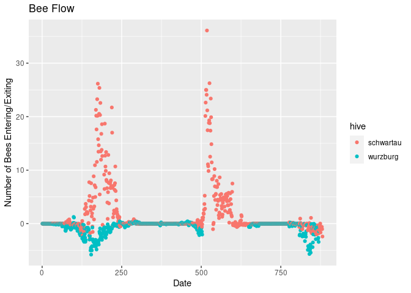<!-- -->

``` r
ggplot(bees, aes(x=day, y=humidity, color=hive)) +
  geom_point() +
  labs(title="Hive Humidity", x="Date", y="% Humidity")
```

    ## Warning: Removed 153 rows containing missing values (geom_point).

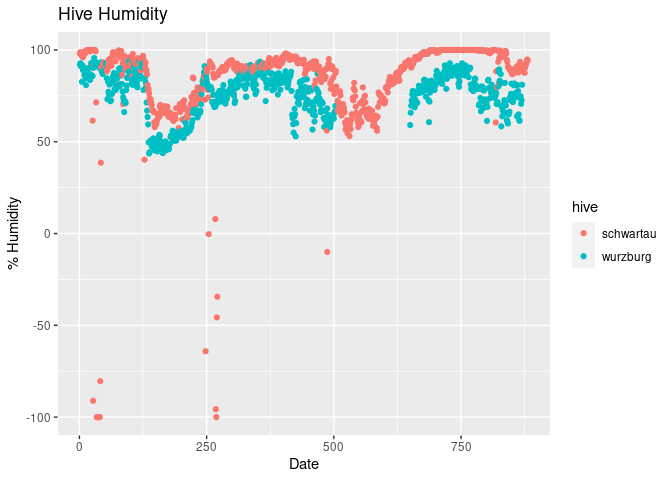<!-- -->

``` r
ggplot(bees, aes(x=day, y=temperature, color=hive)) +
  geom_point() +
  labs(title="Hive Temperature", x="Date", y="Temperature (C)")
```

    ## Warning: Removed 153 rows containing missing values (geom_point).

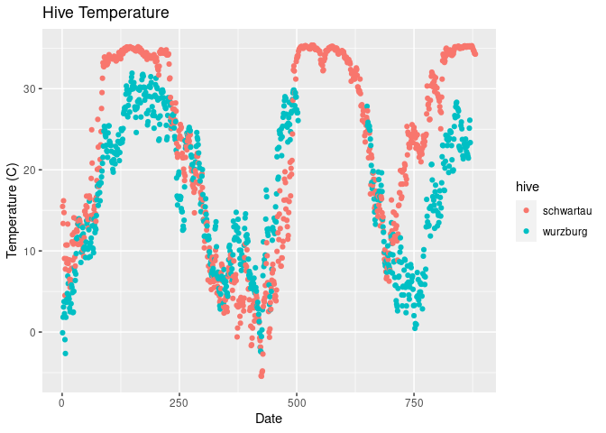<!-- -->

``` r
ggplot(bees, aes(x=day, y=weight, color=hive)) +
  geom_point() +
  labs(title="Hive Weight", x="Date", y="Weight (kg)")
```

    ## Warning: Removed 153 rows containing missing values (geom_point).

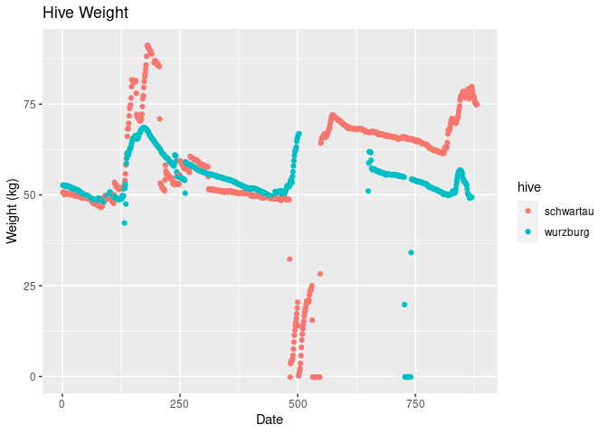<!-- -->

Just from looking at the mean from every day, it seems that the Wurzburg
hive has slightly lower values compared to the Schwartau hive across all
variables. When plotting these variables over time, generally humidity,
temperature, and weight follow the same distribution, only Wurzburg is
slightly offset below Schwartau. Interestingly for bee flow however,
graphically Wurzburg’s flow decreases near the same time that
Schwartau’s flow increases.

The correlation matrix between the numeric variables shows which
variables are strongest and weakly correlated on its upper diagonal, as
well as additional information such a histogram for and distribution
between each variable.

## MANOVA

``` r
# MANOVA test
manova_bees <- manova(cbind(flow,humidity,temperature,weight) ~ hive, data=bees)
summary(manova_bees)
```

    ##             Df  Pillai approx F num Df den Df    Pr(>F)    
    ## hive         1 0.20669   103.76      4   1593 < 2.2e-16 ***
    ## Residuals 1596                                             
    ## ---
    ## Signif. codes:  0 '***' 0.001 '**' 0.01 '*' 0.05 '.' 0.1 ' ' 1

``` r
# univariate ANOVA
summary.aov(manova_bees)
```

    ##  Response flow :
    ##               Df  Sum Sq Mean Sq F value    Pr(>F)    
    ## hive           1  1894.5 1894.50  153.38 < 2.2e-16 ***
    ## Residuals   1596 19713.8   12.35                      
    ## ---
    ## Signif. codes:  0 '***' 0.001 '**' 0.01 '*' 0.05 '.' 0.1 ' ' 1
    ## 
    ##  Response humidity :
    ##               Df Sum Sq Mean Sq F value    Pr(>F)    
    ## hive           1  24507 24507.2  57.023 7.207e-14 ***
    ## Residuals   1596 685919   429.8                      
    ## ---
    ## Signif. codes:  0 '***' 0.001 '**' 0.01 '*' 0.05 '.' 0.1 ' ' 1
    ## 
    ##  Response temperature :
    ##               Df Sum Sq Mean Sq F value    Pr(>F)    
    ## hive           1  14760 14759.7  135.22 < 2.2e-16 ***
    ## Residuals   1596 174214   109.2                      
    ## ---
    ## Signif. codes:  0 '***' 0.001 '**' 0.01 '*' 0.05 '.' 0.1 ' ' 1
    ## 
    ##  Response weight :
    ##               Df Sum Sq Mean Sq F value    Pr(>F)    
    ## hive           1   4171  4171.3  21.761 3.346e-06 ***
    ## Residuals   1596 305930   191.7                      
    ## ---
    ## Signif. codes:  0 '***' 0.001 '**' 0.01 '*' 0.05 '.' 0.1 ' ' 1
    ## 
    ## 153 observations deleted due to missingness

``` r
# post-hoc t-test for each significant variable
pairwise.t.test(bees$flow, bees$hive, p.adj="none")
```

    ## 
    ##  Pairwise comparisons using t tests with pooled SD 
    ## 
    ## data:  bees$flow and bees$hive 
    ## 
    ##          schwartau
    ## wurzburg <2e-16   
    ## 
    ## P value adjustment method: none

``` r
pairwise.t.test(bees$humidity, bees$hive, p.adj="none")
```

    ## 
    ##  Pairwise comparisons using t tests with pooled SD 
    ## 
    ## data:  bees$humidity and bees$hive 
    ## 
    ##          schwartau
    ## wurzburg 7.2e-14  
    ## 
    ## P value adjustment method: none

``` r
pairwise.t.test(bees$temperature, bees$hive, p.adj="none")
```

    ## 
    ##  Pairwise comparisons using t tests with pooled SD 
    ## 
    ## data:  bees$temperature and bees$hive 
    ## 
    ##          schwartau
    ## wurzburg <2e-16   
    ## 
    ## P value adjustment method: none

``` r
pairwise.t.test(bees$weight, bees$hive, p.adj="none")
```

    ## 
    ##  Pairwise comparisons using t tests with pooled SD 
    ## 
    ## data:  bees$weight and bees$hive 
    ## 
    ##          schwartau
    ## wurzburg 3.3e-06  
    ## 
    ## P value adjustment method: none

``` r
# correction (9 tests total)
1 - 0.95^9 # Pr(type I error >= 1)
```

    ## [1] 0.3697506

``` r
0.05/9 # alpha'
```

    ## [1] 0.005555556

The number of tests taken totaled to 9, meaning the Bonfernni corrected
alpha value results to be 5.56e-3. The probability thus of at least one
instance of Type I error becomes 0.37.

Using the adjusted alpha, the MANOVA test shows there is a significant
overall difference between the two hive groups (F&lt;2.2e-16). The
univariate ANOVA test then shows flow (F&lt;2.2e-16), humidity
(F=7.207e-14), temperature (F&lt;2.2e-16), and weight (F=3.346e-06) each
varied significant between the two hives. Lastly, the post-hoc pairwise
t-tests show that the mean values for flow (p&lt;2e-16), humidity
(p=7.2e-14), temperature (p&lt;2e-16), and weight (p=3.3e-06) all were
significantly different between the two hives.

## Randomization

``` r
cors <- vector()
# find correlation of flow with randomized temperature
for(i in 1:5000){
  flow <- bees$flow
  temperature <- sample(bees$temperature, 1751, replace=FALSE)
  cors[i] <- cor(flow,temperature, use="pairwise.complete.obs")
}
# correlation of flow with actual temperature
cor(bees$flow, bees$temperature, use="pairwise.complete.obs")
```

    ## [1] 0.2792873

``` r
{hist(cors, main="Distribution of Flow and Temperature Correlations", xlab="r from randomized samples"); abline(v = 0.279, col="yellow")}
```

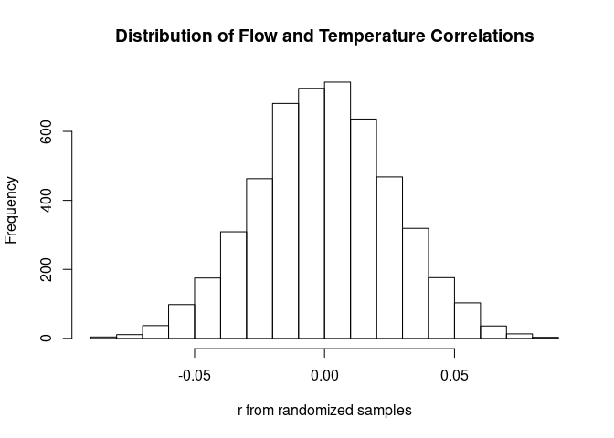<!-- -->

Because flow and temperature showed to have the largest correlation, I
decided to perform a randomization test for this observed correlation
coefficient of 0.28. The histogram of randomly sampled r values,
centered on r=0, show that the coefficient of 0.28 is highly
significant.

## Multiple Linear Regression Model

``` r
# center numerical variables onto mean
bees <- bees %>%
  mutate(flow_c = flow-mean(flow),
         humidity_c = humidity-mean(humidity),
         temperature_c = temperature-mean(temperature),
         weight_c = weight-mean(weight))

# LRM predicting hive flow
fit <- lm(flow ~ humidity_c*temperature_c*weight_c*hive, data=bees)
summary(fit)
```

    ## 
    ## Call:
    ## lm(formula = flow ~ humidity_c * temperature_c * weight_c * hive, 
    ##     data = bees)
    ## 
    ## Residuals:
    ##     Min      1Q  Median      3Q     Max 
    ## -5.0388 -1.1048 -0.3876  0.4774 24.5618 
    ## 
    ## Coefficients:
    ##                                                  Estimate Std. Error t value
    ## (Intercept)                                     1.0825523  0.1241243   8.722
    ## humidity_c                                      0.0043122  0.0079999   0.539
    ## temperature_c                                  -0.0291046  0.0479305  -0.607
    ## weight_c                                        0.1962431  0.0302354   6.491
    ## hivewurzburg                                   -1.5199263  0.1765765  -8.608
    ## humidity_c:temperature_c                        0.0079233  0.0055033   1.440
    ## humidity_c:weight_c                            -0.0086058  0.0028456  -3.024
    ## temperature_c:weight_c                         -0.0093870  0.0046382  -2.024
    ## humidity_c:hivewurzburg                         0.0028986  0.0113214   0.256
    ## temperature_c:hivewurzburg                      0.0522963  0.0678411   0.771
    ## weight_c:hivewurzburg                          -0.1824178  0.0427784  -4.264
    ## humidity_c:temperature_c:weight_c              -0.0020195  0.0006024  -3.352
    ## humidity_c:temperature_c:hivewurzburg          -0.0117377  0.0077860  -1.508
    ## humidity_c:weight_c:hivewurzburg                0.0076364  0.0040264   1.897
    ## temperature_c:weight_c:hivewurzburg             0.0146334  0.0065594   2.231
    ## humidity_c:temperature_c:weight_c:hivewurzburg  0.0023076  0.0008521   2.708
    ##                                                Pr(>|t|)    
    ## (Intercept)                                     < 2e-16 ***
    ## humidity_c                                     0.589946    
    ## temperature_c                                  0.543797    
    ## weight_c                                       1.18e-10 ***
    ## hivewurzburg                                    < 2e-16 ***
    ## humidity_c:temperature_c                       0.150165    
    ## humidity_c:weight_c                            0.002537 ** 
    ## temperature_c:weight_c                         0.043171 *  
    ## humidity_c:hivewurzburg                        0.797966    
    ## temperature_c:hivewurzburg                     0.440915    
    ## weight_c:hivewurzburg                          2.14e-05 ***
    ## humidity_c:temperature_c:weight_c              0.000822 ***
    ## humidity_c:temperature_c:hivewurzburg          0.131895    
    ## humidity_c:weight_c:hivewurzburg               0.058082 .  
    ## temperature_c:weight_c:hivewurzburg            0.025842 *  
    ## humidity_c:temperature_c:weight_c:hivewurzburg 0.006847 ** 
    ## ---
    ## Signif. codes:  0 '***' 0.001 '**' 0.01 '*' 0.05 '.' 0.1 ' ' 1
    ## 
    ## Residual standard error: 2.704 on 1431 degrees of freedom
    ##   (304 observations deleted due to missingness)
    ## Multiple R-squared:  0.1168, Adjusted R-squared:  0.1076 
    ## F-statistic: 12.62 on 15 and 1431 DF,  p-value: < 2.2e-16

``` r
# interaction between hive and temperature
ggplot(bees, aes(y=flow, x=temperature_c, color=hive)) + 
  geom_point() +
  geom_smooth(method=lm, se=FALSE, fullrange=TRUE) +
  ggtitle("Interaction between Hive and Temperature on Flow")
```

    ## `geom_smooth()` using formula 'y ~ x'

    ## Warning: Removed 304 rows containing non-finite values (stat_smooth).

    ## Warning: Removed 304 rows containing missing values (geom_point).

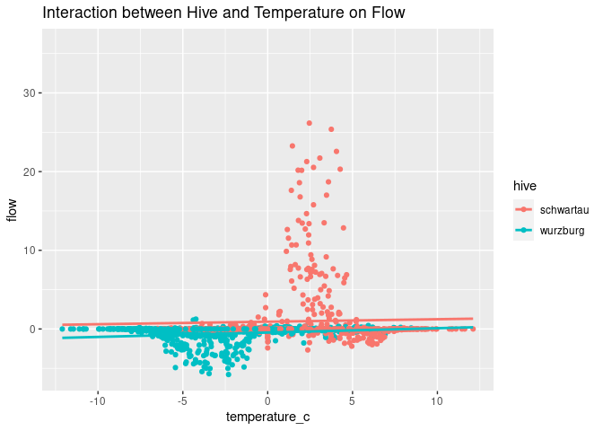<!-- -->

``` r
# assumptions:
plot(fit, which=1) # homoscedasticity
```

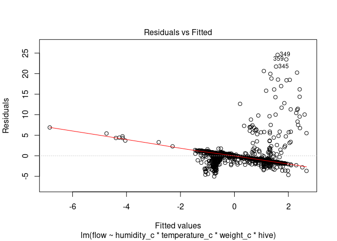<!-- -->

``` r
hist(fit$residuals) # normality
```

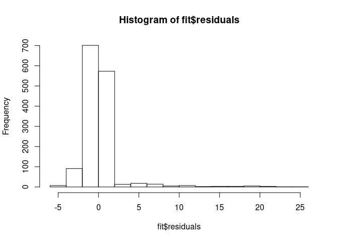<!-- -->

``` r
plot(fit, which=2) # linearity
```

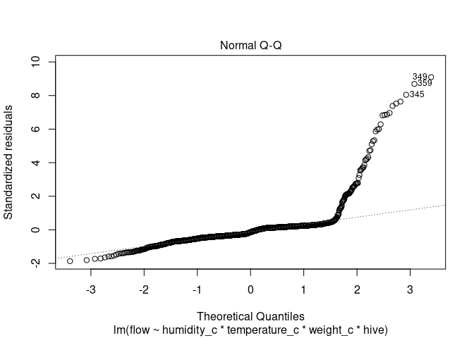<!-- -->

``` r
shapiro.test(fit$residuals)
```

    ## 
    ##  Shapiro-Wilk normality test
    ## 
    ## data:  fit$residuals
    ## W = 0.56016, p-value < 2.2e-16

``` r
# robust standard errors
coeftest(fit, vcov = vcovHC(fit))
```

    ## 
    ## t test of coefficients:
    ## 
    ##                                                  Estimate Std. Error t value
    ## (Intercept)                                     1.0825523  0.1640204  6.6001
    ## humidity_c                                      0.0043122  0.0147134  0.2931
    ## temperature_c                                  -0.0291046  0.0389532 -0.7472
    ## weight_c                                        0.1962431  0.2144100  0.9153
    ## hivewurzburg                                   -1.5199263  0.1705397 -8.9125
    ## humidity_c:temperature_c                        0.0079233  0.0044234  1.7912
    ## humidity_c:weight_c                            -0.0086058  0.0184433 -0.4666
    ## temperature_c:weight_c                         -0.0093870  0.0364568 -0.2575
    ## humidity_c:hivewurzburg                         0.0028986  0.0156255  0.1855
    ## temperature_c:hivewurzburg                      0.0522963  0.0408210  1.2811
    ## weight_c:hivewurzburg                          -0.1824178  0.2270040 -0.8036
    ## humidity_c:temperature_c:weight_c              -0.0020195  0.0036559 -0.5524
    ## humidity_c:temperature_c:hivewurzburg          -0.0117377  0.0047073 -2.4935
    ## humidity_c:weight_c:hivewurzburg                0.0076364  0.0195764  0.3901
    ## temperature_c:weight_c:hivewurzburg             0.0146334  0.0386942  0.3782
    ## humidity_c:temperature_c:weight_c:hivewurzburg  0.0023076  0.0038810  0.5946
    ##                                                 Pr(>|t|)    
    ## (Intercept)                                    5.771e-11 ***
    ## humidity_c                                       0.76950    
    ## temperature_c                                    0.45508    
    ## weight_c                                         0.36020    
    ## hivewurzburg                                   < 2.2e-16 ***
    ## humidity_c:temperature_c                         0.07347 .  
    ## humidity_c:weight_c                              0.64085    
    ## temperature_c:weight_c                           0.79684    
    ## humidity_c:hivewurzburg                          0.85286    
    ## temperature_c:hivewurzburg                       0.20036    
    ## weight_c:hivewurzburg                            0.42177    
    ## humidity_c:temperature_c:weight_c                0.58077    
    ## humidity_c:temperature_c:hivewurzburg            0.01276 *  
    ## humidity_c:weight_c:hivewurzburg                 0.69653    
    ## temperature_c:weight_c:hivewurzburg              0.70535    
    ## humidity_c:temperature_c:weight_c:hivewurzburg   0.55222    
    ## ---
    ## Signif. codes:  0 '***' 0.001 '**' 0.01 '*' 0.05 '.' 0.1 ' ' 1

``` r
# bootstrapped standard errors
samp_SEs <- replicate(5000, {
  # resample
  boot_data <- sample_frac(bees, replace=TRUE)
  # LRM
  fitboot <- lm(flow ~ humidity_c*temperature_c*weight_c*hive, data=bees)
  # coefficients
  coef(fitboot)
})
samp_SEs %>%
  t %>%
  as.data.frame %>%
  # standard deviation of the sampling distribution
  summarize_all(sd)
```

    ##   (Intercept) humidity_c temperature_c weight_c hivewurzburg
    ## 1           0          0             0        0            0
    ##   humidity_c:temperature_c humidity_c:weight_c temperature_c:weight_c
    ## 1                        0                   0                      0
    ##   humidity_c:hivewurzburg temperature_c:hivewurzburg weight_c:hivewurzburg
    ## 1                       0                          0                     0
    ##   humidity_c:temperature_c:weight_c humidity_c:temperature_c:hivewurzburg
    ## 1                                 0                                     0
    ##   humidity_c:weight_c:hivewurzburg temperature_c:weight_c:hivewurzburg
    ## 1                                0                                   0
    ##   humidity_c:temperature_c:weight_c:hivewurzburg
    ## 1                                              0

``` r
coeftest(fit)[,1:2]
```

    ##                                                    Estimate   Std. Error
    ## (Intercept)                                     1.082552269 0.1241242561
    ## humidity_c                                      0.004312216 0.0079998754
    ## temperature_c                                  -0.029104618 0.0479304519
    ## weight_c                                        0.196243073 0.0302353504
    ## hivewurzburg                                   -1.519926293 0.1765765011
    ## humidity_c:temperature_c                        0.007923295 0.0055033471
    ## humidity_c:weight_c                            -0.008605843 0.0028456164
    ## temperature_c:weight_c                         -0.009386996 0.0046381834
    ## humidity_c:hivewurzburg                         0.002898590 0.0113214003
    ## temperature_c:hivewurzburg                      0.052296326 0.0678411494
    ## weight_c:hivewurzburg                          -0.182417834 0.0427784381
    ## humidity_c:temperature_c:weight_c              -0.002019452 0.0006024092
    ## humidity_c:temperature_c:hivewurzburg          -0.011737701 0.0077860378
    ## humidity_c:weight_c:hivewurzburg                0.007636445 0.0040263893
    ## temperature_c:weight_c:hivewurzburg             0.014633445 0.0065594053
    ## humidity_c:temperature_c:weight_c:hivewurzburg  0.002307579 0.0008520909

``` r
coeftest(fit, vcov = vcovHC(fit))[,1:2]
```

    ##                                                    Estimate  Std. Error
    ## (Intercept)                                     1.082552269 0.164020369
    ## humidity_c                                      0.004312216 0.014713360
    ## temperature_c                                  -0.029104618 0.038953179
    ## weight_c                                        0.196243073 0.214409969
    ## hivewurzburg                                   -1.519926293 0.170539665
    ## humidity_c:temperature_c                        0.007923295 0.004423387
    ## humidity_c:weight_c                            -0.008605843 0.018443251
    ## temperature_c:weight_c                         -0.009386996 0.036456754
    ## humidity_c:hivewurzburg                         0.002898590 0.015625532
    ## temperature_c:hivewurzburg                      0.052296326 0.040820963
    ## weight_c:hivewurzburg                          -0.182417834 0.227004033
    ## humidity_c:temperature_c:weight_c              -0.002019452 0.003655868
    ## humidity_c:temperature_c:hivewurzburg          -0.011737701 0.004707253
    ## humidity_c:weight_c:hivewurzburg                0.007636445 0.019576435
    ## temperature_c:weight_c:hivewurzburg             0.014633445 0.038694206
    ## humidity_c:temperature_c:weight_c:hivewurzburg  0.002307579 0.003881022

The resulting linear regression model coefficients can be interpreted as
follows: 1. When Schwartau has a mean humidity, temperature, weight, the
predicted flow of the hive in a day is about 1.082 bees. 2. Controlling
for average daily temperature, weight, and hive, for every 1% increase
in humidity from the mean results in about a daily 0.004 increase in
predicted flow of bees. 3. Controlling for average daily humidity,
weight, and hive, for every 1 C increase in temperature from the mean
results in about a daily 0.029 decrease in predicted flow of bees. 4.
Controlling for average daily humidity, temperature, and hive, for every
1 kg increase in weight from the mean results in about a daily 0.196
increase in predicted flow of bees. 5. Controlling for average daily
humidity, temperature, and weight, Wurzburg hive will have about a daily
1.520 decrease in predicted bee flow compared to Schwartau. 6. The slope
for centered humidity on flow is 0.008 higher for every 1 unit increase
in centered temperature. 7. The slope for centered humidity on flow is
0.009 lower for every 1 unit increase in centered weight. 8. The slope
for centered temperature on flow is 0.009 lower for every 1 unit
increase in centered weight. 9. The slope for centered humidity on flow
is 0.003 higher for Wurzburg compared to Schwartau. 10. The slope for
centered temperature on flow is 0.052 higher for Wurzburg compared to
Schwartau. 11. The slope for centered weight on flow is 0.182 lower for
Wurzburg compared to Schwartau. 12. The slope for centered humidity on
flow is 0.002 lower for every 1 unit increase in centered temperature
and weight. 13. The slope for centered humidity on flow is 0.012 lower
for every 1 unit increase in centered temperature for Wurzburg compared
to Schwartau. 14. The slope for centered humidity on flow is 0.008
higher for every 1 unit increase in centered weight for Wurzburg
compared to Schwartau. 15. The slope for centered temperature on flow is
0.015 higher for every 1 unit increase in centered weight for Wurzburg
compared to Schwartau. 16. The slope for centered humidity on flow is
0.002 higher for every 1 unit increase in temperature and weight for
Wurzburg compared to Schwartau.

According to the adjusted R squared statistic, this multiple linear
model accounts for 0.107 of the variation in bee flow.

The model’s fitted values plotted against its residuals shows a lack of
homoscedasticity due to the unqueal residual distance across all fitted
values. The model also shows a lack of linearity as shown by the Q-Q
plot, again near the ends of its theoretical quantiles. This is most
likely for the same reason of a large amount of outliers existing in the
data. The histogram of residuals also does not easily show normal
distribution for this very reason, although the Shapiro-Wilk normality
test does verify normality (p&lt;2.2e-16).

Recalculating for robust standard errors, the coefficients of the model
remain the same, however there are far less significant coefficients
compared to the model with original standard errors.

Bootstrapping resampled data shows no difference compared to the linear
model created with the original dataset. This is most likely due to the
large amount of observations present.

## Logistic Regression Model

``` r
# creation of a flow binary variable (0 = net loss, 1 = net gain)
bees2 <- bees %>% 
  na.omit() %>% # remove days where data is missing
  mutate(flow_bin = ifelse(flow>=0,1,0))
fit2 <- glm(flow_bin ~ humidity_c+temperature_c+weight_c+hive, data=bees2, family="binomial")
summary(fit2)
```

    ## 
    ## Call:
    ## glm(formula = flow_bin ~ humidity_c + temperature_c + weight_c + 
    ##     hive, family = "binomial", data = bees2)
    ## 
    ## Deviance Residuals: 
    ##     Min       1Q   Median       3Q      Max  
    ## -0.9796  -0.9306  -0.5467  -0.5198   2.0398  
    ## 
    ## Coefficients:
    ##                Estimate Std. Error z value Pr(>|z|)    
    ## (Intercept)   -0.607032   0.086002  -7.058 1.68e-12 ***
    ## humidity_c     0.005730   0.004504   1.272    0.203    
    ## temperature_c -0.007429   0.018606  -0.399    0.690    
    ## weight_c       0.001135   0.009385   0.121    0.904    
    ## hivewurzburg  -1.200657   0.151767  -7.911 2.55e-15 ***
    ## ---
    ## Signif. codes:  0 '***' 0.001 '**' 0.01 '*' 0.05 '.' 0.1 ' ' 1
    ## 
    ## (Dispersion parameter for binomial family taken to be 1)
    ## 
    ##     Null deviance: 1623.5  on 1446  degrees of freedom
    ## Residual deviance: 1527.7  on 1442  degrees of freedom
    ## AIC: 1537.7
    ## 
    ## Number of Fisher Scoring iterations: 4

``` r
# add model response probability
bees2$flow_prob <- predict(fit2, type="response", na.rm=TRUE)
mean(bees2$flow_prob)
```

    ## [1] 0.2487906

``` r
# add prediction based off model
bees2$flow_predict <- ifelse(bees2$flow_prob>0.25,"gain","loss")
# confusion matrix
table(truth = bees2$flow_bin, prediction = bees2$flow_predict)
```

    ##      prediction
    ## truth gain loss
    ##     0  460  627
    ##     1  259  101

``` r
(627+259)/(627+259+460+101) # accuracy
```

    ## [1] 0.6123013

``` r
259/(259+101) # sensitivity
```

    ## [1] 0.7194444

``` r
627/(627+460) # specificity
```

    ## [1] 0.5768169

``` r
259/(259+460) # precision
```

    ## [1] 0.3602225

``` r
# log-odds vs outcome graph
bees2$logit <- predict(fit2)
ggplot(bees2, aes(logit, fill=as.factor(flow_bin))) +
  geom_density(alpha=0.5) +
  labs(title="log-odds vs outcome", fill="flow binary")
```

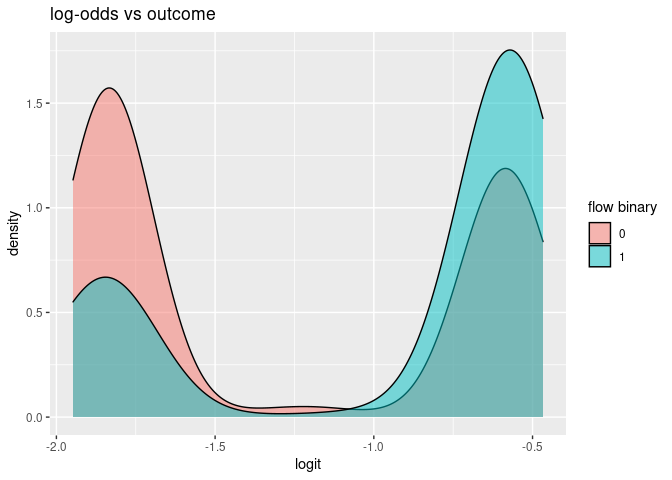<!-- -->

``` r
ROC <- ggplot(bees2) +
  geom_roc(aes(d=flow_bin, m=flow_prob)) +
  labs(title="ROC Curve for Beehive Gain/Loss",
       x="False Positive Fraction (1 - Specificity)",
       y="True Positive Fraction (Sensitivity)")
ROC
```

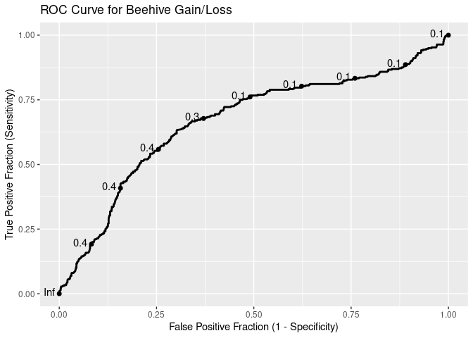<!-- -->

``` r
calc_auc(ROC)
```

    ##   PANEL group      AUC
    ## 1     1    -1 0.665633

A logistic regression model was created to predict the newly created
binary variable “flow\_bin”. Flow (binary) was created under the idea
that if “flow” was positive, there is a net gain in bees that day, and
is denoted with a 1, and if “flow” was negative, there is a net loss in
bees that day, and is denoted with a 0. The resulting logistic
regression model coefficients can be interpreted as follows: 1. When
Schwartau has a mean humidity, temperature, and weight, there is a
ln(0.607) decrease in odds that there was a net gain in bees. 2.
Controlling for average daily temperature, weight, and hive, for every 1
unit increase in humidity from the mean, there is a ln(0.006) increase
in odds that there was a net gain in bees. 3. Controlling for average
daily humidity, weight, and hive, for every 1 unit increase in
temperature from the mean, there is a ln(0.007) decrease in odds that
there was a net gain in bees. 4. Controlling for average daily humidity,
temperature, and hive, for every 1 unit increase in weight from the
mean, there is a ln(0.001) increase in odds that there was a net gain in
bees. 5. Controlling for average faily humidty, temperature, and weight,
Wurzburg has a ln(1.20) decrease in odds that there was a net gain in
bees compared to Schwartau.

A cutoff value of 0.25 was used, which resulting in an accuracy of 0.61,
sensitivity of 0.72, specificity of 0.58, and precision of 0.36. The
model unfortunately is not very accurate in predicting a net gain or
loss in bees.

The area under the ROC curve was 0.6656, so a randomly selected hive
with a positive flow has a test value larger than a randomly selected
hive with negative flow 66.56% of the time; the model correctly
distinguished the two 66.56% of the time, which again is not ideal
considering it’s closeness to 50%. A model with interaction terms may be
more significant in results.

More notably however, it seems that only the hive itself is playing a
significant role in determining daily flow. Meaning, at least in this
case, it can be concluded that each hive had a variable flow rate, and
moreover it can be hypothesized that hives in general have variable flow
rates for reasons other than environmental conditions. An additional
experiment with more than two different hives and additional
environmental conditions would be useful to further conclude this
hypothesis.
